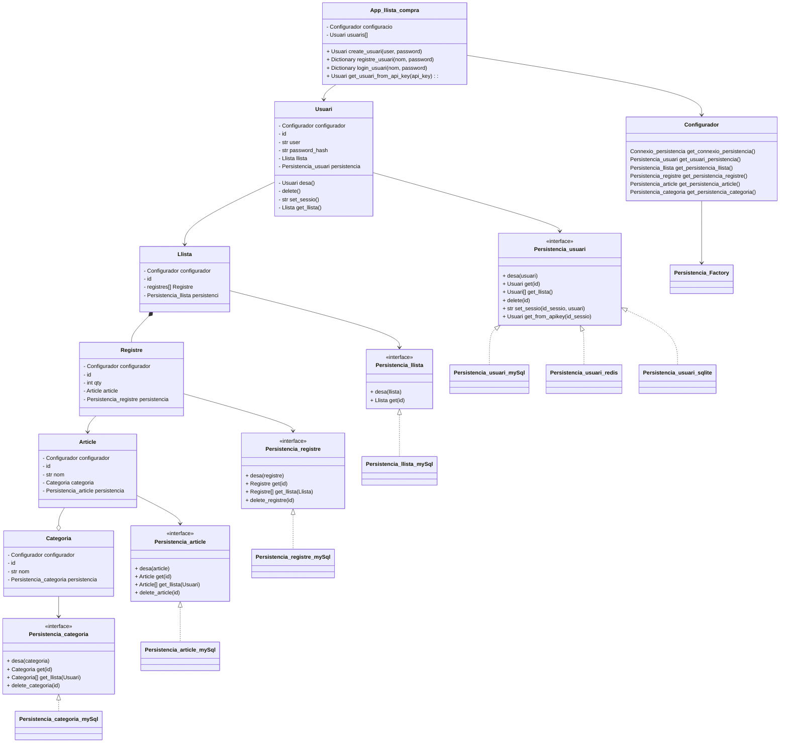

[Link en MarkDown](https://hackmd.io/@JdaXaviQ/HJ283-zPs)

# M06 Accés a dades. Projecte llista de la compra.

## Introducció:
Segur que has anat alguna vegada a comprar i quan has tornat a casa te n’has adonat que se t’ha oblidat alguna cosa. 
Ens passa a tots. Però hem pensat en solucionar-ho per tal que no ens passi més. Així el que us demanem és el disseny d’una aplicació que ens ajudi amb la llista de la compra.
Evidentment la llista de la compra està formada per diferents articles que haurien d’estar organitzats per categories (com per exemple, fleca, peix, carn...) i de cada article en voldrem una determinada quantitat. Per posar un exemple, de la categoria begudes, voldria comprar llaunes de “cola loca”, en concret 12 llaunes.
D’aquesta manera quan anem a comprar i estiguem en un passadís o secció del
supermercat, a part de consultar tota la llista de la compra, podrem demanar a la aplicació que ens mostri només els articles que siguin de la categoria concreta (amb l’exemple anterior, podria consultar els articles de la categoria begudes).

## Descripció:
De moment començarem per realitzar el backend en forma d'API-RESTfull que podrà servir per a qualsevol tipus d'aplicació client, ja sigui una aplicació mòbil, una aplicació d'escriptori o una aplicació web.
La aplicació comença amb les següents categories precaarregades, però l'usuari podrà afegir, modificar o eliminar les categories que vulgui:
* Frescos
* Begudes
* Làctis
* Neteja
* Fruita i verdures

## Històries d'usuari:
id | Descripció | Importància | Cost
---|---|:---:|---:
1 | **[Tècnica]** Abans de començar necessitem  el diagrama de classes UML | 1000000 | 2h
2 | Com a usuari no registrat vull poder registrarme a la aplicació. | 1000 | 5h
3 | Com a usuari registrat vull poder identificar-me a la aplicació. | 1000 | 2h
4 | Com a usuari identificat vull poder afegir articles a qualsevol categoria existent | 900 | 0,5h
5 | Com a usuari identificat vull poder afegir registres d'articles existents a la meva llista | 800 | 0,5h
6 | Com a usuari identificat vull poder veure el contingut de la meva llista | 800 | 0,5h
7 | Com a usuari identificat vull poder veure el contingut de la meva llista filtrant per categoria | 800 | 0,5h

## Tecnologies a utilitzar:
En la primera verssió utilitzarem:
* Python com a llenguatge de programació
* Flask com a framework per a que sigui més fàcil generar una API REST.
* MariaDB o MySQL com a SGBD.

## Diagrama de classes:
